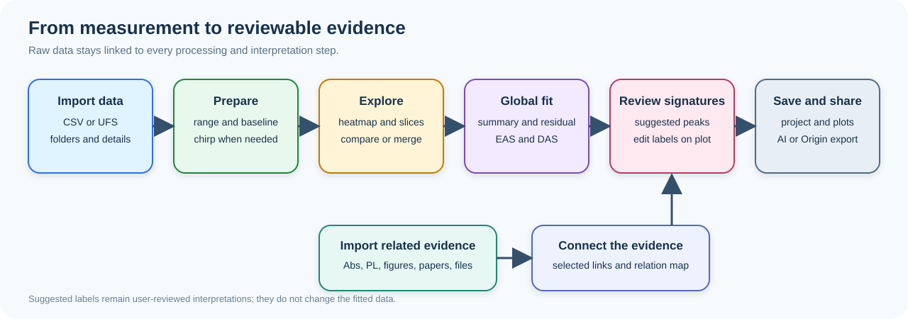

# SpecFlowLab

SpecFlowLab is a public-beta portfolio project for provenance-preserving time-resolved spectroscopy.

It imports CSV and UFS data, applies explicit treatments, compares and merges
VIS/NIR measurements, previews global analysis, and hands off exact project
data to OriginPro 8.6 or later on Windows.

Start with the 60-second demo in docs/DEMO.md, the job-search brief in
docs/JOB_SEARCH.md, or the reproducibility note in docs/REPRODUCIBILITY.md.



## Why this project belongs on a public GitHub profile

This repository combines a Tauri desktop shell, parser and archive core,
VIS/NIR merge workflow, OriginPro bridge contract, bilingual interface,
examples, tests, CI, release documentation, and a clear validation boundary.
It is intentionally honest about what still needs stronger numerical
validation before publication-grade kinetic fitting claims.

Before extending it, review
docs/ENGINEERING_NOTES.md, especially the immutable data model, native service
boundary, project format, numerical validation, and Tauri security requirements.

Implemented version 1.0 scope:

- the main workspace follows a tall project/dataset rail, central
  information/heatmap/fit-summary column, and right-side
  spectrum/kinetics/component-spectra column; the component panel receives
  more vertical plot space while every canvas remains clipped inside its card;
- the interface can be switched between polished English and Simplified
  Chinese, remembers the choice locally, and leaves scientific abbreviations,
  filenames, sample names, and numerical data unchanged;
- Manual and About dialogs provide an in-app workflow guide, version and
  copyright information, and the product feedback address;
- datasets live in one-level project folders such as VIS, NIR, and IR;
  files imported together enter one folder, and datasets can be moved by a
  dedicated stable drag grip or desktop context menu without changing their
  source CSV or UFS files;
- CSV/text matrices and Ultrafast Systems `Version2` `.ufs` raw-data files
  enter the same processing workflow; UFS acquisition metadata is copied into
  the editable dataset note while the original binary remains immutable;
- project-owned Dataset Details save display names, sample notes, technique,
  scientific role, sample/preparation IDs, candidate species/states, and
  the most relevant experimental conditions in one compact upper record;
  less-used conditions remain available without crowding the primary view;
- the lower Connected Evidence workspace imports external spectroscopy and
  characterization files, figures, documents/manuscripts, and literature into
  a project evidence library through a dedicated Finder, drag-and-drop, and
  clipboard-paste panel; exact source bytes, checksums, rights/citation
  metadata, and provenance survive `.sflproj` save/reopen;
- checkbox selection can apply one reviewed relationship type and authored
  rationale to multiple evidence items, while a focused one-hop relation map
  visualizes only explicit edges and never infers scientific identity;
- merge selection is available only for treated datasets, and the Merge command
  sits between Chirp and Reset so the product workflow is treatment-first;
- exactly two treated VIS/NIR datasets can enter the focused merge workspace:
  it orders the probes by wavelength, uses their already calibrated analysis
  time axes without an additional hidden time-zero shift, linearly resamples
  onto measured common time support without extrapolation, and lets the user
  retain explicit clean wavelength subranges in one compact join/output row;
- VIS/NIR merging uses a hard spectral join: smoothing is diagnostic only and
  never changes saved signals, optional overlap matching applies at most one
  positive amplitude factor, and both parent datasets remain immutable;
- merged datasets are stored as derived portable CSV-backed records with parent
  lineage, time-shift convention, resampling method, amplitude-scale decision,
  exclusions, warnings, spectral segments, and wavelength-axis breaks preserved
  through project archives, treatments, AI handoff, and Origin bundles;
- analysis-range, baseline, chirp, and reset operations apply to the active
  folder, while range values are captured before progress rendering and
  resolved against each dataset's physical axes;
- the main screen links the heatmap, spectrum, and kinetics views through a
  synchronized time/wavelength crosshair;
- spectra and heatmaps leave unmeasured wavelength gaps blank and draw an axis
  break instead of visually connecting disjoint VIS/NIR segments;
- compressed `.sflproj` archives preserve each imported CSV text or UFS binary
  exactly once, materialize each treated matrix once as portable little-endian
  Float64 data, and retain folder membership, treatments, selections, UFS
  metadata, and fit parameters;
- derived fit matrices and component spectra are rebuilt deterministically
  from the treated matrix and saved fit parameters when a project is opened;
- legacy `.sfl.json` preview projects remain readable and are migrated to
  `.sflproj` the next time they are saved;
- project, processing, comparison, fitting, and AI-export commands are placed
  near the content they affect;
- a versioned `.sflorigin` interoperability bundle exports exact source CSV or
  UFS data, a derived matrix CSV for OriginPro compatibility, treated
  axes/matrices, selections, metadata, and available plot-ready
  fitted/residual/DAS/EAS results for the standalone OriginPro Python bridge;
- the Windows app can create an Origin project directly while retaining the
  `.sflorigin` provenance bundle beside it: OriginPro 8.6–2020 uses an
  experimental COM adapter that exports metadata, treated/selected data, and
  available fit/DAS/EAS sheets to `.opj` without automatic graphs, while
  OriginPro 2021+ uses the embedded Python adapter and defaults to `.opju`;
  both paths
  require the expected workbook count and a non-empty saved project before
  reporting success, and OriginPro 8.5 or older is rejected;
- Origin heatmaps place wavelength on the horizontal axis and log-scaled time
  on the vertical axis from 0.1 ps to the measured maximum; line graphs are
  created on independent one-layer pages, and IRF-limited components are
  always omitted from interpreted lifetime/component sheets and plots while
  retained only in the internal fit provenance and full fitted/residual data;
- comparison starts with dataset checkboxes and opens a coordinated
  kinetics/spectra/EAS/DAS workspace with one reusable color, width, dash
  style, and legend name per sample;
- completed fits reveal a lifetime summary and switchable EAS/DAS panel on the
  main screen, with EAS selected by default;
- deterministic feature labels are drawn directly on their EAS/DAS regions and
  repeated inside the corresponding lifetime-table row; positive regions are
  ESA candidates, negative regions remain GSB/SE candidates, and only explicit
  absorption/PL connections refine their context;
- a Gaussian-informed Feature Finder ranks resolved major and minor bands with
  controllable relative peak threshold, minimum Gaussian R-squared, and minimum
  FWHM; shape likeness remains a candidate filter rather than assignment proof;
- the derived Feature × Time Map compresses every candidate wavelength band
  into a measured-time trace and reports cell reduction, wavelength coverage,
  and a piecewise reconstruction score instead of claiming that the lossy map
  replaces the authoritative treated fsTA heatmap; both candidates and the
  compressed map are available to AI Investigation export;
- IRF-limited components are excluded permanently from interpreted lifetime
  tables, EAS/DAS, comparisons, feature labels, Feature x Time maps, AI feature
  evidence, and Origin outputs; the fit retains them internally only to
  reproduce fitted/residual matrices and provenance;
- every scientific plot supports drag-selected physical-region magnification,
  bounded enlargement, and compact plot-local PNG or tab-delimited TXT export
  from its context menu; enlarged spectrum and kinetics views retain their
  time and wavelength selectors, respectively;
- dataset and folder context menus are anchored to the item that opened them;
  folder menus provide scoped import and clipboard paste without exposing the
  WebView's generic Reload action;
- batch global fitting processes only datasets that do not already have a
  current fit and preserves completed fit results;
- global fitting accepts editable lifetime starts and explicit per-lifetime
  `Fix` controls; entering a value alone does not fix it;
- the Tauri icon depicts photons traveling through a guided fluid-like path;
- Tauri save commands use native destination dialogs for projects, Markdown
  briefs, `.sflai` investigation packages, Origin interoperability
  bundles/projects, and exported figures;
- AI Investigation requires a scientific question and explicit scope, previews
  Brief/Diagnostic/Full evidence locally, assigns stable `E###` citations,
  exports checksummed CSV/JSON evidence with concise `brief.md` and `prompt.md`,
  keeps raw sources/full matrices opt-in, and performs no provider upload;
- a versioned `specflowlab.evidence_graph.v1` layer preserves dataset entities,
  proposed species/state hypotheses, Unicode note annotations, and authored
  factual or interpretive connections without duplicating numerical data;
  connected investigations traverse one reviewed relationship hop and export
  connection IDs, inclusion rationale, and matching/different/unknown condition
  reports without inferring identity or scientific equivalence; connected
  external evidence contributes metadata and derived previews, while exact
  source bytes enter Full packages only after raw-source opt-in and rights review;
- explicit project, job, dataset, and result states replace the ambiguous
  `Ready` label.

Remaining production gaps:

- `.sflproj` is now a versioned ZIP archive, but per-entry checksums and a
  streaming native archive writer are still future hardening work;
- the comparison and fitting workspaces are focused in-app windows rather than
  separate operating-system windows;
- the numerical core still uses the JavaScript coordinate-search nonlinear
  preview. It needs a validated variable-projection optimizer, uncertainty
  estimates, and reference-dataset regression tests before publication use.
- Gaussian shape scores, Feature Finder thresholds, and Abs/PL overlap are
  heuristic. Real bands may be asymmetric, overlapping, clipped, or
  non-Gaussian. Validated
  uncertainty, peak deconvolution, model selection, user-confirmed persistent
  feature nodes, and species-level proof remain future work.

## Product Direction

- Main screen: import, project save/load, baseline, chirp, post-treatment merge,
  reset, compare, global fitting, and question-driven AI Investigation export.
- Comparison workspace: opened from one `Compare` button, with dataset-linked plot styles, legend names, line colors, thickness, and line style.
- Global fitting workspace: opened only when fitting is needed, with component count, IRF, batch fitting, DAS, EAS, and fit statistics.
- Scientific core: maintained in `src/lib/parser-core.js`, with parser and
  numerical behavior covered by fixtures in `tests/`.

## Current State

The `1.0.5` desktop application is implemented and syntax-checked, and its
spectroscopy and archive workflows are exercised with synthetic regressions
and the real 20-dataset example project.

Verified commands:

```bash
node --check src/main.js
node --check src/lib/parser-core.js
npm run build
npm test
npm run test:origin
npm run tauri -- --version
npm run tauri -- build --bundles app
```

Built and checksum-verified release artifacts are produced locally. The app bundle
and portable installers are intentionally published as GitHub Release assets,
not committed to this source repository; see docs/RELEASE_CHECKLIST.md.

The macOS app bundle is arm64, ad-hoc signed for local testing, and passes
`codesign --verify --deep --strict` before and after ZIP extraction. The
Windows portable artifact is a PE32+ x86-64 GUI executable with embedded
matching `FileVersion` and `ProductVersion`; it is unsigned and still requires a
target-Windows/WebView2 smoke test.

## Public-beta package

- Safe synthetic inputs are in examples/ and the walkthrough is in docs/DEMO.md.
- Reproducible commands and limitations are in docs/REPRODUCIBILITY.md.
- GitHub Actions runs JavaScript, Origin bridge, build, and Rust checks on push.
- Release notes are in CHANGELOG.md; large installers belong in GitHub Releases.
- The project is released under the MIT License. See LICENSE.
- Citation metadata is in CITATION.cff. The archived release is available at
  [Zenodo DOI 10.5281/zenodo.21839697](https://doi.org/10.5281/zenodo.21839697).

## Run Frontend

```bash
cd /Volumes/MacData/Work/Software-dev/SpecFlowLab/SpecFlowLab-app
npm install
npm run dev
```

Open the Vite URL printed by the command.

## Run Tauri Shell

Rust is installed on this Mac. In a fresh shell, load Cargo if needed:

```bash
source "$HOME/.cargo/env"
```

Then:

```bash
cd /Volumes/MacData/Work/Software-dev/SpecFlowLab/SpecFlowLab-app
npm install
npm run tauri:dev
```

## Build Installers

```bash
npm run tauri:build
```

The current config targets:

- macOS `.app` and `.dmg`
- Windows NSIS installer

For early macOS local testing, `src-tauri/tauri.conf.json` uses ad-hoc signing:

```json
"signingIdentity": "-"
```

For public distribution, replace this with Developer ID signing and notarization.

Current DMG status: the `.app` target builds successfully. Full `npm run tauri:build` reaches DMG packaging but the generated `bundle_dmg.sh` currently exits with an error without detailed output. Use `npm run tauri -- build --bundles app` for local macOS testing.

## Notes

- Keep the portable HTML demo in the parent development workspace only; the
  reproducible public demo is documented in docs/DEMO.md.
- See `integrations/origin/README.md` for the `.sflorigin` format, Origin
  commands, scientific data mapping, and Windows integration boundary.
- Use this desktop shell to test the real project workflow, native file
  destinations, coordinated comparison, and focused analysis workspaces.
- The next numerical milestone is replacing the current coordinate-search nonlinear fit with a stronger variable-projection optimizer.

A provenance-preserving desktop workspace for time-resolved spectroscopy.
